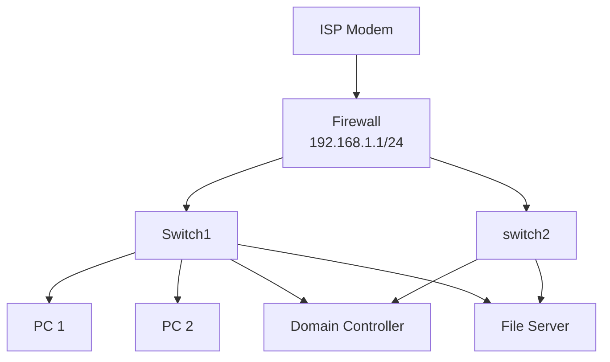

Markdown And KB Documentation
=============================================
Notes on markdown and creating knowledge-base information in markdown format. 


Summary 
-----------------------------------------------------


### Why Markdown Files
Markdown files provide a simple low barrier to entry in a documentation format that can be read even if all you have is a simple notepad file editor. While there are other formats with much better features when it comes to writing anything beyond simple readme files, markdown still has some of the best adoption numbers in the industry. 


### References 
More detailed references for further follow up on these topics. 

* Mermaid Documentation - https://mermaid.js.org/intro/
* Markdown Documentation - https://docs.github.com/en/get-started/writing-on-github/getting-started-with-writing-and-formatting-on-github/basic-writing-and-formatting-syntax


Markdown 
----------------------------------------------------

### Headings

Heading are mad using 
```md
# Heading 1
## Heading 2
### Heading 3
#### Heading 4
##### Heading 5
###### Heading 6
```


Mermaid Diagrams
--------------------------------------------------
Using mermaid diagrams in yor documentation. 


### Simple Flowcharts 


### Pattern For Network Diagrams 
Demonstrates a simple network diagram. These can be used as a draft before moving to a more properly formatted diagram. 




